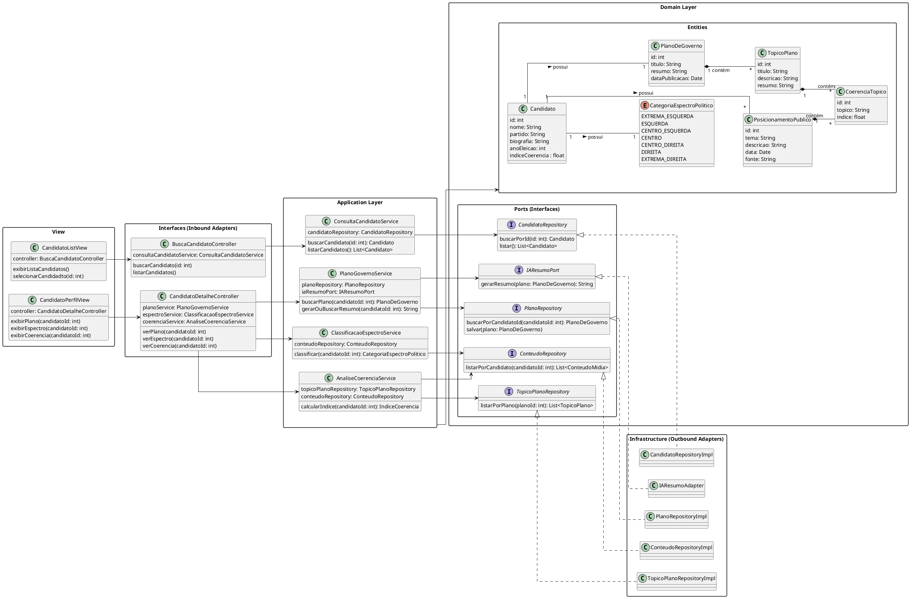

# Diagrama de Classe de Implementação
[![](https://img.plantuml.biz/plantuml/svg/ZLTDRkCs5Dxp58GtTWQO0Rer1i6ujb0Oc6bS9osw6z3IiqCCHGeabJPei-q1UekUepVfIKfI4ad9f19lBF7zVU-7xprzKff8tTOC8VMDyeP8KkE6bD_81UxrCmCieTI4NnX438noqCyDO27req0CpXfhWIMzF6fSKIj21KUeLuGNlr3uRO7_GAXaH2cy9RoY5T7YCrNQqWm9zxzIS2q5Oo3N-FjMbSGpRpt5C_i7-9sUgBJg0hzQtNYw0WQbmKHaJwwqMD5gZIdN7TSBSdyJW0UGPyfc87hE7MZ27k5ra0T6k5YLWzm-1X6u2jMOAChN6RS29F2IaWodyUiboiIUQ-CIAK7XrPwVHCihlAb8OqxLJPIYNEXj68p_gcLHfEz1Fj4IJ3Go51FRarKeFI4AFhDPawEqlLnLobLuBP36Xj8RTu7zGJo1z8S8Gn_70D7gfMTQafA8OaorhlNHzFmRJWn0s4u8nYDZA9jBGvlBe27FvMsIiqtJC8FNtYdycJo3ZAzI9k8kJyFP4HgXg1RoEIhOS3YJdOW_bQWrjbVkep-w3PbBPCEdBCPp61yWJCaHL5kBWsakQxpVX3UFCnFsNjaEUhC8Nq0IUTUwOfQTefJOlPQKNmBsJCujVYqQMeh3r8k7rB6xAHhQQfo0gpDaKyNAbX6vDzXAI67iA1vIT4Lc2hg_hM_4u1N9580jqN0HafB1na4mgetNqtBTYPhGk58zfU3QI81AZG8BjQywXBcemQV5p2EfQIN2mOcAYoHdIiAH2Np1m60NlGewZXTUupCJH4yArDVAoBn1sRB8ddIL4zuDNd9eJwoB-HhlJ6Y2ugWMPhLMe4hP8SuO2bXDbjpuge6ReUHCJvH3JMPLMymzKdoswR-sueFLUJ3Mxuw2kYwyKL21jtM-HgokujU7O_5byxMu_-dduhZRc1F_j2r-V3ZUVPqUUC9kVops3-RSFmpQXeD94Tf-uKRSCEwwuKQ7zrGVj23x1YFalffhWfdM5zHFMi58zJPShhSqCKNOax7eEkUKUZEsccn3rdQ7sjZkMgVJ5ImwJoBPYI_NtMAaCaoDX3DTa7e5NsX5oKHvtE2jMjUo-rQTTZakt9V9SdEMH6dPbhgLW5TthSvlE8a2sDSDYxj3afACSKI_ZbP47Bpj0RcQNU9X4VllhxznDEmHocvXxz_VpYnRCrkJ5KmjIg-8p6vDhyXcDwXbxAnptjrQWp-tr3WegGKcjMruLoF67DzupSZDVykPdlHp4gbXEpkqSqBBBZukKkDIZr8UNTAFVtxua2tpQPDmpAcgJlSKnvw_2ecMqQ59NuvH4t2CLnTbYVkzGW9p1QCUQQCYn_7YkuK9dVlBpw4rDePLI_5jMdAo5Soolrja1dCaXIOAhUoxNZXU5DPkJ_ltdnh50H-nJyTp44cZU9ki2Qpxl3qEOOr2wZ_FRKLcFyPJ7ykZYthzQOoMRZlqHZ5AVUHO9M5dHEWJyAgjsVy0)](https://editor.plantuml.com/uml/ZLTDRkCs5Dxp58GtTWQO0Rer1i6ujb0Oc6bS9osw6z3IiqCCHGeabJPei-q1UekUepVfIKfI4ad9f19lBF7zVU-7xprzKff8tTOC8VMDyeP8KkE6bD_81UxrCmCieTI4NnX438noqCyDO27req0CpXfhWIMzF6fSKIj21KUeLuGNlr3uRO7_GAXaH2cy9RoY5T7YCrNQqWm9zxzIS2q5Oo3N-FjMbSGpRpt5C_i7-9sUgBJg0hzQtNYw0WQbmKHaJwwqMD5gZIdN7TSBSdyJW0UGPyfc87hE7MZ27k5ra0T6k5YLWzm-1X6u2jMOAChN6RS29F2IaWodyUiboiIUQ-CIAK7XrPwVHCihlAb8OqxLJPIYNEXj68p_gcLHfEz1Fj4IJ3Go51FRarKeFI4AFhDPawEqlLnLobLuBP36Xj8RTu7zGJo1z8S8Gn_70D7gfMTQafA8OaorhlNHzFmRJWn0s4u8nYDZA9jBGvlBe27FvMsIiqtJC8FNtYdycJo3ZAzI9k8kJyFP4HgXg1RoEIhOS3YJdOW_bQWrjbVkep-w3PbBPCEdBCPp61yWJCaHL5kBWsakQxpVX3UFCnFsNjaEUhC8Nq0IUTUwOfQTefJOlPQKNmBsJCujVYqQMeh3r8k7rB6xAHhQQfo0gpDaKyNAbX6vDzXAI67iA1vIT4Lc2hg_hM_4u1N9580jqN0HafB1na4mgetNqtBTYPhGk58zfU3QI81AZG8BjQywXBcemQV5p2EfQIN2mOcAYoHdIiAH2Np1m60NlGewZXTUupCJH4yArDVAoBn1sRB8ddIL4zuDNd9eJwoB-HhlJ6Y2ugWMPhLMe4hP8SuO2bXDbjpuge6ReUHCJvH3JMPLMymzKdoswR-sueFLUJ3Mxuw2kYwyKL21jtM-HgokujU7O_5byxMu_-dduhZRc1F_j2r-V3ZUVPqUUC9kVops3-RSFmpQXeD94Tf-uKRSCEwwuKQ7zrGVj23x1YFalffhWfdM5zHFMi58zJPShhSqCKNOax7eEkUKUZEsccn3rdQ7sjZkMgVJ5ImwJoBPYI_NtMAaCaoDX3DTa7e5NsX5oKHvtE2jMjUo-rQTTZakt9V9SdEMH6dPbhgLW5TthSvlE8a2sDSDYxj3afACSKI_ZbP47Bpj0RcQNU9X4VllhxznDEmHocvXxz_VpYnRCrkJ5KmjIg-8p6vDhyXcDwXbxAnptjrQWp-tr3WegGKcjMruLoF67DzupSZDVykPdlHp4gbXEpkqSqBBBZukKkDIZr8UNTAFVtxua2tpQPDmpAcgJlSKnvw_2ecMqQ59NuvH4t2CLnTbYVkzGW9p1QCUQQCYn_7YkuK9dVlBpw4rDePLI_5jMdAo5Soolrja1dCaXIOAhUoxNZXU5DPkJ_ltdnh50H-nJyTp44cZU9ki2Qpxl3qEOOr2wZ_FRKLcFyPJ7ykZYthzQOoMRZlqHZ5AVUHO9M5dHEWJyAgjsVy0)

---

### Descrição 

O sistema é organizado em camadas:

#### 1. Interfaces (Inbound Adapters)

  - Controllers expõem endpoints para busca de candidatos e detalhes de seus planos, espectro político e coerência.

  - Exemplo: BuscaCandidatoController delega chamadas para ConsultaCandidatoService.

#### 2. Application Layer

  - Contém services que implementam a lógica de aplicação, coordenando a comunicação entre os repositórios, adaptadores e entidades de domínio.

  - Exemplo: PlanoGovernoService busca planos e gera resumos via IA (IAResumoPort).

#### 3. Domain Layer

  - Define as entidades centrais (Candidato, PlanoDeGoverno, TopicoPlano, etc.) e enums (CategoriaEspectroPolitico), representando o núcleo do negócio.

  - As entidades mantêm relacionamentos importantes, como cada candidato possuindo um plano de governo, índice de coerência e categoria política.

#### 4. Ports (Interfaces)

  - Interfaces que abstraem dependências externas, como repositórios de dados e adaptadores de IA.

  - Permitem que a Application Layer não dependa diretamente da implementação de infraestrutura.

#### 5. Infrastructure (Outbound Adapters)

  - Implementações concretas das interfaces de portas (RepositoryImpl, IAResumoAdapter) que interagem com bancos de dados ou serviços externos.

---

## Codificação do Diagrama

