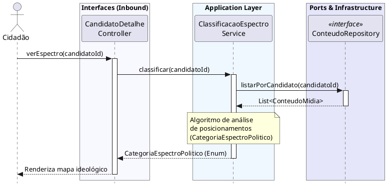

# Visualizar Espectro Político
[](https://editor.plantuml.com/uml/TLDHYXf14FqVc3iK2a4_zW8YiiPTWk32aX3ouqzjTwd5zdHDkdiavZOXHyWHl5YgHyVTYN4-XYcwtdlrNlNSnuGXDPKhY_ZAliQ05SHqSAJlmERgYButv0qzKOoufRdZhGT3Fb4eYx90aoJ0OC4MxV6t300ZV8sdinVv0ODbxjoWeGYZfN-Hnjln08QVTXBJjnqdAWlGHyKI6wxH9sL3RvKmoGCbT3jQ-uNu5CGv2gt28WKTahm5rRX8pUlQiS74uc65Xzmxr7aDVNJDVsKSniWRXHYKnrYJKOsr_q9Xhw1MwFnzhVKi8KNu04k_2QZ1DHfSKCnmXNljpG5Swwa9QgnyfbeYQsw7LYENC9ro5zHirfFBQSBThFKC4zXJw4OTcIwdfHstg-0z9ZgdKnOjGf5d4mes5yVX5lZYk2mwd5AqCqx0SRuzwlsoeLiq6L0MBUokDy9AAQPT4azi6TMkfN-0PU552r6txx1pjvN0gHAm1EYFltGUlHnQv42DxXqhlPaIrtwqKBBSZLrQp-9OTo7ZdhMtO6y2OFJecshSc_9TIgUKbQTTr4GDvFNpJuGAQmIs9ExuPwj4FORJakwrMN-ulm00)
---
## Codificação do Diagrama

