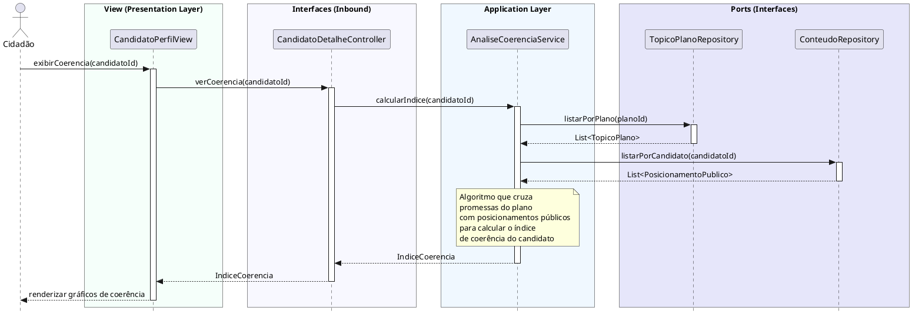

# Visualizar Índices de Coerência

---
## Codificação do Diagrama

```plantuml
@startuml
skinparam style strictuml
skinparam sequenceMessageAlign center
skinparam ParticipantPadding 40
skinparam ParticipantMinWidth 140
skinparam BoxPadding 20

actor "Cidadão" as User

box "View (Presentation Layer)" #MintCream
participant "CandidatoPerfilView" as View
end box

box "Interfaces (Inbound)" #GhostWhite
participant "CandidatoDetalheController" as Ctrl
end box

box "Application Layer" #AliceBlue
participant "AnaliseCoerenciaService" as Service
end box

box "Ports (Interfaces)" #Lavender
participant "TopicoPlanoRepository" as RepoTopico
participant "ConteudoRepository" as RepoConteudo
end box


User -> View : exibirCoerencia(candidatoId)
activate View

View -> Ctrl : verCoerencia(candidatoId)
activate Ctrl

Ctrl -> Service : calcularIndice(candidatoId)
activate Service

Service -> RepoTopico : listarPorPlano(planoId)
activate RepoTopico
RepoTopico --> Service : List<TopicoPlano>
deactivate RepoTopico

Service -> RepoConteudo : listarPorCandidato(candidatoId)
activate RepoConteudo
RepoConteudo --> Service : List<PosicionamentoPublico>
deactivate RepoConteudo

note over Service
Algoritmo que cruza
promessas do plano
com posicionamentos públicos
para calcular o índice
de coerência do candidato
end note

Service --> Ctrl : IndiceCoerencia
deactivate Service

Ctrl --> View : IndiceCoerencia
deactivate Ctrl

View --> User : renderizar gráficos de coerência
deactivate View

@enduml
```
