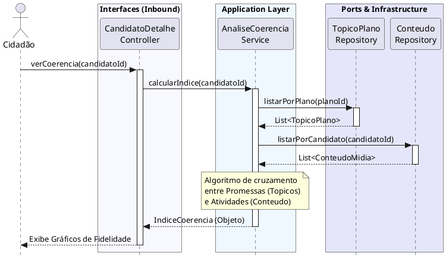

# Visualizar Índices de Coerência

[](https://editor.plantuml.com/uml/TLJRZjem47sFb7yOWLJ1m_x0gbfjIjiL4gkYNjGNNWPx0EyQJsexQEdVLFsK_R6EdG2Xi7cm0fuvvyoPcTo7Y3usMriMuTcu6Zrk8SIz9JczKHTNzAiXf-YHGi0rLTQi7IXoaNnPb0Mgo1u64wDHl_xb0M207o7TBVa51jCKjq950KPJj-J6wV40XWyR3l7dnaGg2v17gA9HfaON1GkT5hZ87ocYtT32JTX5pzQIp_YJw4KYEGt2qH5LTMsDmcZOmGptAN8eMXLziCqraigXDO4cJ5wgCxXmtyZl93upTE__aypPnm3lOEfM7iMjHjpoaZ6SuKuYKzKNHD-vDehd5Xqlt5UgEHXnR9zfqi_s_feDKZGr-dhMez46U_BA8faEDtVP7BY57VbZRIDrS7IgnxbbPeUHEX_B8gT8QbUrP2kqgh7efvAdwAtyeqjbSKWLb5DH0YGUoxY9Rzc0KPtESv2-1xtKcpCzCu5vttFohYmqNOMua9ATwYivZjTRPVNyFG5SqNDeK0wuLDH1b8LZ-OUb8Js0ogxPcxXbq0JADxznAoiblPRJ4ymzRzE-oTQqXOMnN44by6dHqZOTsCTdDPy6e6tTSGPWz6NvH365ztJsEjWEWUJdGRg5JozcIV3WN_-i4d_I-Tbeifd_3AGTetkPHVbq_0C0)

---
## Codificação do Diagrama

